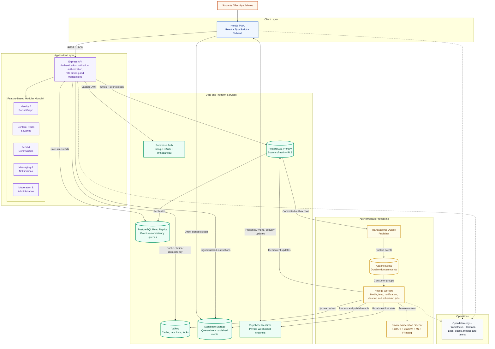

# System Architecture Diagram

## TIET Campus Social Platform

## One-minute explanation

The platform uses a **feature-based modular monolith with event-driven workers**. Users access a Next.js progressive web application, while all business operations pass through one Express API. The API is divided into independent feature modules, which keeps the semester project manageable while preserving clear boundaries for future scaling.

PostgreSQL is the source of truth. Valkey only stores temporary or reconstructable data, such as feed caches and rate limits. Media is uploaded directly to private storage using signed instructions, but it remains quarantined until asynchronous workers and the private moderation service approve it.

Business changes and event records are committed together using the transactional outbox pattern. The outbox publisher sends durable events to Kafka, and workers handle moderation, media processing, notifications, feed updates, and cleanup. Supabase Realtime is used only for transient WebSocket updates; persistent messages and notifications remain retrievable from PostgreSQL if realtime delivery fails.

## Key design choice

This is intentionally **not a microservices architecture**. A modular monolith provides simpler deployment and database transactions for a student team, while Kafka, workers, API contracts, and strict module boundaries leave a clear path for extracting services later if usage requires it.
