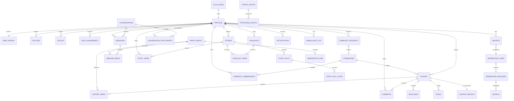

# Entity-Relationship Design

This diagram is the logical model. The executable baseline is `infra/sql/0001_initial_schema.sql`.

## Ownership boundaries

- Identity owns profiles, private identity data, roles, follows, and blocks.
- Content owns posts, reels, media relations, comments, reactions, saves, and metrics.
- Communities owns requests, communities, memberships, and rules.
- Messaging owns conversations, participants, messages, and read state.
- Stories owns ephemeral publication, views, polls, and highlights.
- Moderation owns scans, findings, reports, cases, decisions, and appeals.
- Platform owns notifications, feature flags, outbox, idempotency, and audit records.

Modules may reference another module's public identifier, but only the owning module writes that entity. Cross-module state changes use declared services or events.

## Sensitive-data separation

`profiles` contains campus-visible data. `user_private` contains email, provider identity, export status, and deletion metadata. It is never joined into public profile queries. Message bodies and moderation evidence are excluded from analytics and general Kafka topics.
