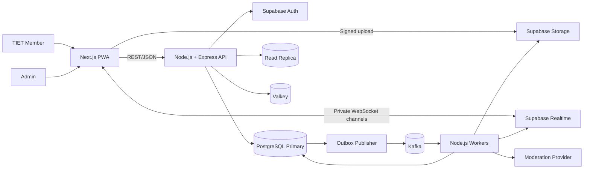

# High-Level Design

## 1. Architectural style

The system uses a **feature-based modular monolith with event-driven workers**.

- Next.js is the frontend application.
- Express is the only public business API.
- Feature modules are the primary code boundary.
- Kafka connects durable asynchronous workflows.
- Supabase Realtime provides transient WebSocket communication.
- Valkey accelerates operations through the Redis protocol but never owns permanent data.
- PostgreSQL is the source of truth.

This gives the project production-oriented boundaries without the deployment and consistency cost of premature microservices. A module may later be extracted behind its existing API and event contracts.

## 2. System context

## 3. Main components

### Next.js PWA

- App Router and TypeScript
- Server components for initial data rendering where useful
- Client components for media, gestures, realtime state, and composition
- Feature-based UI folders
- Supabase browser client only for Auth, signed Storage operations, and Realtime
- No business database access from the browser

### Express API

- Validates Supabase JWTs
- Applies request validation, authorization, rate limits, and idempotency
- Owns synchronous business use cases
- Routes consistent reads to the primary and safe stale reads to the replica
- Writes domain changes and outbox events atomically
- Produces signed upload instructions

### Node.js workers

- Publish database outbox records to Kafka
- Consume moderation, media, notification, feed, and cleanup events
- Use consumer groups, retry policies, idempotency records, and dead-letter handling
- Run scheduled jobs through database leases rather than relying on one permanent process leader

### Supabase

- Auth: Google OAuth and institutional-domain verification
- PostgreSQL: authoritative relational data
- Storage: quarantine and published media buckets
- Realtime: private Broadcast/Presence channels
- RLS: database-level protection for user-scoped data

### Kafka

Kafka carries durable domain events. The local demonstration uses one KRaft broker. Production scale would require multiple brokers and replicated partitions.

### Valkey

Valkey is the fully open-source Redis-compatible store for feed cache entries, rate-limit counters, idempotency keys, temporary locks, and trending sorted sets. All entries have bounded lifetimes or can be reconstructed.

## 4. Read/write strategy

The architecture uses command-query separation, not a literal write-only database.

- The primary accepts all writes and consistency-sensitive reads.
- The replica serves discovery feeds, search, public profiles, community listings, and analytics.
- Newly written resources are read from the primary for a bounded consistency window.
- Replica health and lag determine whether the query router falls back to the primary.
- Messaging history, permissions, moderation, and administrative operations always use the primary.

## 5. Core data flows

### Content publication

1. Client requests an upload session from Express.
2. Express authorizes the action and returns a signed quarantine upload.
3. Client uploads directly to Storage.
4. Express creates content in `pending_scan` and writes an outbox event in one transaction.
5. Publisher sends the event to Kafka.
6. Moderation and media workers scan/process the asset.
7. Approved media moves to the published bucket and content becomes visible.
8. Flagged media remains private and appears in the admin queue.
9. Realtime communicates the final state to the author.

### Messaging

1. Express verifies conversation membership and block state.
2. Text or media is persisted as pending where moderation is required.
3. A Kafka worker completes moderation.
4. Approved messages become deliverable.
5. Realtime broadcasts the message to the private conversation channel.
6. Push failure does not lose the message; clients retrieve history from the API.

### Feed generation

1. Interaction events are stored and published.
2. Feed workers update aggregate ranking features.
3. Workers maintain Valkey trending sets and invalidate affected feed caches.
4. API retrieves candidates from aggregate tables, filters authorization, and ranks them.
5. The replica serves safe feed queries; primary fallback handles lag or failure.

## 6. Deployment views

### Lightweight development

- Next.js and Express on developer machine
- Free hosted Supabase
- Optional local Valkey
- In-process event adapter or local Kafka
- Mock moderation provider

### Full architecture demonstration

- Docker Compose network
- Next.js, Express, worker, and outbox publisher containers
- Self-hosted Supabase services
- PostgreSQL primary and streaming replica
- Kafka KRaft broker
- Valkey
- Prometheus and Grafana

### Production evolution

- Multiple stateless web/API/worker replicas
- Managed PostgreSQL failover and read replicas
- Three or more Kafka brokers
- Replicated Valkey or compatible managed equivalent
- CDN-backed media delivery
- Centralized telemetry and alerting

## 7. Failure behavior

| Failure | Expected behavior |
| --- | --- |
| Valkey unavailable | Bypass cache, use database-backed limits where essential |
| Kafka unavailable | Transactions succeed; outbox remains pending for later delivery |
| Worker crashes | Kafka reassigns/redelivers; idempotency prevents duplicate effects |
| Replica unavailable or lagging | Query router falls back to primary |
| Moderation provider unavailable | Content stays private and retries or enters manual review |
| Realtime unavailable | Persistent data remains available through polling/refetch |
| Storage upload abandoned | Cleanup worker removes expired quarantine objects |
