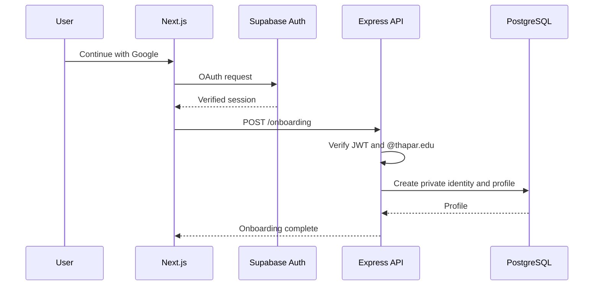
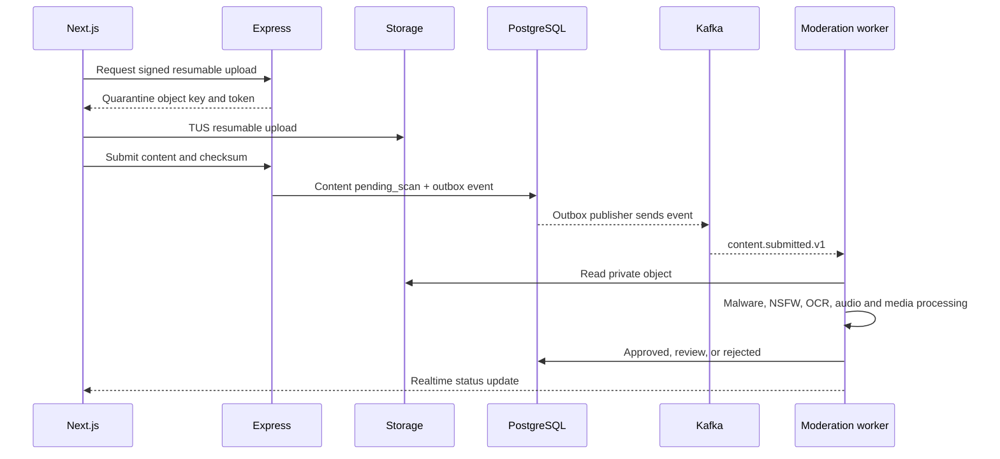

# Sitemap and User Flows

## Sitemap

```text
Public
  /login
  /auth/callback
  /legal/terms
  /legal/privacy

Member application
  /onboarding
  /feed/discover
  /feed/following
  /reels
  /create
  /communities
  /communities/[slug]
  /messages
  /messages/[conversationId]
  /stories/[storyId]
  /notifications
  /profile/[username]
  /settings/account
  /settings/privacy
  /settings/data

Administration
  /admin/moderation
  /admin/community-requests
  /admin/users
  /admin/audit
  /admin/feature-flags
```

## Authentication and onboarding



Sessions use short-lived access tokens and refresh tokens managed by Supabase. A member must reauthenticate at least every 30 days for the pilot. Disabled, suspended, or banned profiles are denied even when a token remains cryptographically valid.

## Content upload and moderation



## Account export and deletion

- Export: member confirms the request; a worker generates JSON metadata and signed media links; download expires after 72 hours.
- Deletion: member reauthenticates, sees consequences, and enters a 30-day recoverable deletion period.
- During the deletion period the profile is hidden and login can restore the account.
- After 30 days, private identity data and owned content are removed or anonymized according to conversation, audit, appeal, and legal-retention rules.
- Messages retained for other participants show a deleted-user tombstone and no profile link.

## Infinite feeds

- Express returns opaque cursor pagination.
- TanStack Query stores bounded pages.
- IntersectionObserver prefetches before the final item.
- Reels use scroll snapping, one active player, and DOM virtualization.
- The browser reports watch events in batches; it never blocks scrolling on analytics submission.
